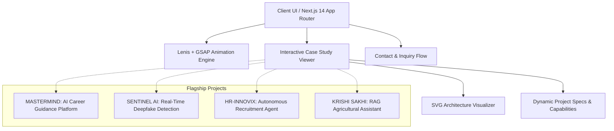

# ⚡ DHARANI V — Engineering Portfolio

[](https://nextjs.org/)
[](https://www.typescriptlang.org/)
[](https://tailwindcss.com/)
[](https://www.framer.com/motion/)
[](https://greensock.com/gsap/)
[](https://opensource.org/licenses/MIT)

> A cutting-edge, interactive portfolio showcasing Full-Stack Engineering, AI Systems, Deepfake Detection, and Autonomous Workflow Automation. Designed with high-performance animations, fluid micro-interactions, responsive typography, and dynamic interactive architecture diagrams.

---

## 🌟 Key Highlights & Features

- ⚡ **Ultra-Smooth Scrolling**: Integrated with [Lenis](https://lenis.darkroom.engineering/) and GSAP ticker sync for seamless inertial scrolling.
- 🎨 **Dynamic Aesthetic & Dark Mode**: Handcrafted color palette with neon accents, glassmorphic HUD overlays, radar sweeps, and terminal visuals.
- 📐 **Interactive Architecture Visualizer**: Custom SVG-based architecture diagram renderer dynamically illustrating data flow across client, API, AI engines, and storage layers.
- 🔠 **Kinetic Typography & Micro-Animations**: Scramble-text decipher effects, typewriter status lines, and count-up metrics for engaging user feedback.
- 📱 **Fully Responsive Layout**: Pixel-perfect cross-platform experience across mobile, tablet, and ultra-wide displays.
- 🚀 **Next.js App Router Architecture**: Optimized static and dynamic route generation with deep-dive case studies for each flagship project.

---

## 🏗️ System Architecture Flow



---

## 💼 Featured Case Studies

### 1. [MASTERMIND](https://team-8-95a3.vercel.app) — AI Career Guidance Platform
- **Role:** Technical Team Lead & Full-Stack Developer
- **Stack:** Next.js 16, Express.js, Gemini 2.5 Flash, Supabase, MongoDB Atlas, JWT
- **Highlights:** Ingests PDF/DOCX resumes, extracts structured skill graphs via Gemini 2.5 Flash, surfaces skill gaps against target roles, and generates dynamic multi-week learning roadmaps. Dual-database architecture separating relational metrics from document data.

### 2. [SENTINEL AI](https://deep-detection.vercel.app) — Real-Time Deepfake Detection
- **Role:** Deep Learning Engineer & Frontend Developer
- **Stack:** Python, PyTorch, CNNs, React.js
- **Highlights:** End-to-end computer vision pipeline capturing frame sequences, evaluating temporal inconsistencies via CNNs, and streaming real-time threat probabilities with sub-second latency.

### 3. [HR-INNOVIX](https://hr-innovix-agent.vercel.app) — Autonomous Recruitment Agent
- **Role:** Full-Stack Developer
- **Stack:** React.js, Gemini API, Node.js, Tailwind CSS
- **Highlights:** High-throughput batch resume parser and semantic job-matcher that scores candidate profiles against job specifications, dramatically reducing recruiter screening cycles.

### 4. [KRISHI SAKHI](https://krishi-sakhi-smoky.vercel.app) — AI Agricultural Assistant
- **Role:** AI & Automation Engineer
- **Stack:** n8n, RAG, Node.js, VectorDB
- **Highlights:** RAG-powered agricultural advisor orchestrated with n8n workflows, retrieving domain knowledge from vector embeddings and combining live weather telemetry for localized farming recommendations.

---

## 📂 Project Structure

```bash
portfolio/
├── app/
│   ├── globals.css              # Global styles, variables, & utility classes
│   ├── layout.tsx               # Root layout, metadata, & font configuration
│   ├── page.tsx                 # Landing page orchestrating sections
│   └── project/[slug]/
│       └── page.tsx             # Dynamic case study route
├── components/
│   ├── layout/                  # Navbar, Footer, SmoothScrollProvider
│   ├── project/                 # CaseHero, CaseArchitecture, CaseCapabilities, etc.
│   ├── sections/                # Hero, About, Journey, Stack, SelectedWork, Contact
│   └── ui/                      # RadarRings, Terminal, EyebrowLabel, ProjectCard, etc.
├── data/
│   └── projects.ts              # Strongly-typed project catalog & journey chapters
├── hooks/
│   ├── useCountUp.ts            # Eased numerical counters
│   ├── useScrambleText.ts       # Matrix-style text scramble decryption
│   └── useTypewriter.ts         # Character-by-character typewriter effect
├── public/                      # Static assets & favicons
├── tailwind.config.ts           # Custom themes, colors, and animations
└── tsconfig.json                # TypeScript strict configuration
```

---

## 🛠️ Getting Started Locally

### Prerequisites
- Node.js 18.x or higher
- npm, yarn, or pnpm

### Setup Commands
```bash
# 1. Clone the repository
git clone https://github.com/DHARANIVIP/PortfolioUP.git

# 2. Navigate to project root
cd PortfolioUP

# 3. Install dependencies
npm install

# 4. Launch local development server
npm run dev
```

Visit [http://localhost:3000](http://localhost:3000) to explore the portfolio.

---

## 🚀 Building for Production

```bash
# Build optimized bundle
npm run build

# Preview production build
npm run start
```

---

## 📬 Contact & Connect

- **Developer:** Dharani V
- **GitHub:** [@DHARANIVIP](https://github.com/DHARANIVIP)
- **LinkedIn:** [Dharani V](https://www.linkedin.com/in/dharani-v-92194a314/)
- **Contact:** Available via portfolio contact form & on-demand copy button
- **Live Portfolio:** [PortfolioUP](https://github.com/DHARANIVIP/PortfolioUP)

---

## 📄 License

This project is licensed under the [MIT License](LICENSE).
